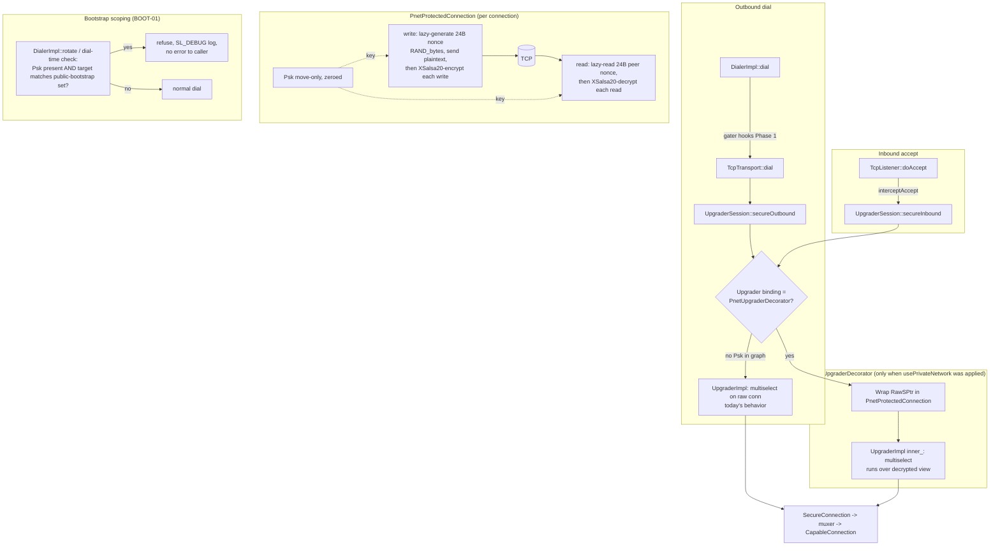

# Phase 2: Private network (pnet) PSK protector - Research

**Researched:** 2026-08-26
**Domain:** libp2p pnet spec v1 (PSK/XSalsa20) integration into the C++17 Boost.DI upgrade pipeline
**Confidence:** HIGH (wire protocol verified against the official spec and go-libp2p source fetched this session; all codebase claims verified by direct source reads)

## Summary

Phase 2 builds three new components — a `Psk` type (dual-format parsing, move-only, zeroed), a vendored XSalsa20 primitive under `libp2p::crypto`, and a `PnetProtectedConnection` + `PnetUpgraderDecorator` pair that wraps the `RawConnection` before `UpgraderImpl` runs multiselect — plus a `usePrivateNetwork(key)` DI module and a dial-time public-bootstrap refusal in `DialerImpl`. All the architectural skeletons were validated in Phase 1's milestone research (`.planning/research/ARCHITECTURE.md`) and the discuss-phase locked every open design decision (D-01 through D-13), so this research focused on the two remaining risk areas: **exact wire-format semantics** and **C++/Boost.DI mechanical details** that determine whether implementation succeeds on the first pass.

The wire protocol is now confirmed byte-level from primary sources: the pnet spec's pseudocode and go-libp2p's `psk_conn.go` (both fetched this session). The critical detail that research-rendering often gets wrong: **there are TWO nonces per connection, one per direction, exchanged lazily** — each side's write-path generates a 24-byte nonce and sends it as the first 24 plaintext bytes of its outgoing stream; each side's read-path reads 24 bytes before initializing its decryptor. There is no negotiation, no MAC, no handshake confirmation — a wrong-PSK peer simply decrypts garbage and multiselect fails naturally. This maps cleanly onto this codebase's `Reader::read/readSome` + `Writer::write/writeSome` virtual interfaces, with three C++-specific traps (partial-read keystream positioning, const-input write buffers that must be copy-encrypted, and callback reentrancy) documented below.

The bootstrap-scoping analysis (BOOT-01) found that this codebase's **only** public-bootstrap vector is `kBootstrapAddress = "/dnsaddr/bootstrap.libp2p.io"` in `include/libp2p/peer/address_repository.hpp` (verified by grep — there is no hardcoded go-libp2p bootstrap peer-ID list anywhere in `src/`), reachable via `AddressRepository::bootstrap()`'s default overload. Kademlia itself (`KademliaImpl::bootstrap()`) dials only known peers and has no default public list. This materially simplifies D-12's dial-time refusal: the primary match target is a single dnsaddr string, supplemented by a small snapshot of public bootstrap peer IDs for post-DNS-resolution addresses.

**Primary recommendation:** Implement in dependency order — vendored XSalsa20 + vectors → `Psk` parsing/hygiene → `PnetProtectedConnection` (pure decorator over `RawConnection`, lazy per-direction nonces) → `PnetUpgraderDecorator` (wraps only the two `RawSPtr` methods; the two `StrSPtr` relay overloads pass through) → `usePrivateNetwork()` DI module → `DialerImpl` refusal — with each layer unit-tested before the next is built.

<user_constraints>
## User Constraints (from CONTEXT.md)

### Locked Decisions

### XSalsa20 crypto provider
- **D-01:** Vendor a small, self-contained public-domain XSalsa20 implementation (~150 lines, as go-libp2p itself does with golang.org/x/crypto/salsa20) under the crypto layer — do **not** add libsodium or Crypto++ as a Hunter dependency. This eliminates the MSVC/Hunter packaging risk flagged in STATE.md as a phase blocker. OpenSSL lacks XSalsa20, which is why a vendored primitive is needed at all.
- **D-02:** Expose the primitive as plain free function(s) in the `libp2p::crypto` namespace (`outcome::result` style) — low-ceremony like the existing crypto provider code. No new provider interface, no DI binding for the cipher itself.
- **D-03:** Validate the vendored cipher against **published XSalsa20/libsodium test vectors** (fixed key+nonce+plaintext → expected ciphertext), mirroring how upstream go-libp2p tests its vendored copy.
- **D-04:** The 24-byte handshake nonce on the initiating side comes from **OpenSSL `RAND_bytes`** (already wired into the codebase's crypto providers). User guidance: "whatever matches spec — go-libp2p uses Go's `crypto/rand` (standard OS CSPRNG); OpenSSL `RAND_bytes` is the direct C++ equivalent here."

### PSK config surface
- **D-05:** The `Psk` type accepts **both** the go-ipfs `swarm.key` file text (`/key/swarm/psk/1.0.0/` + `/base16/` or `/base64/` framing) **and** a raw hex/base64 string/byte constructor — existing GNUS swarm.key files work as-is. Parse errors are explicit failures, never silent truncation/acceptance. Validate exactly 32 bytes (256-bit) at parse time.
- **D-06:** PSK hygiene per research (PITFALLS.md §3): dedicated non-copyable `Psk` type (move-only), explicit zeroing destructor (`OPENSSL_cleanse` or equivalent non-optimizable clear), never passed as raw `std::vector<uint8_t>`, and never logged — enforce the no-logging rule in tests/review.
- **D-07:** A **single combined named DI module** (e.g. `usePrivateNetwork(key)`) binds both the `Psk` and the pnet-enabled marker in one call — one line turns on private-network mode. The pair cannot be configured independently, so half-configured states are impossible by construction.
- **D-08:** **No default binding** — absence of the module means no `Psk` in the graph, no pnet wrapper at all, public mode, exactly today's behavior. Absence is meaningful and checked once at injector/host-construction time (mirrors Phase 1's null-object default philosophy).

### Force-pnet trigger (PNET-05)
- **D-09:** The combined `usePrivateNetwork(key)` module **is** the private-network-mode signal: enabling it requires the `Psk` to parse to exactly 32 bytes or construction fails explicitly. No env var (`LIBP2P_FORCE_PNET` equivalent rejected — DI-only, matching the project constraint), no separate mode flag to fall out of sync.
- **D-10:** The failure surfaces at **injector build / host-construction time** (`makeHostInjector` / DI-graph construction) — the earliest impossible-to-miss point. No `Host` object ever exists in a broken half-configured state; no zombie Host failing per-dial.

### Bootstrap scoping (BOOT-01)
- **D-11:** **Silent filter** — when a `Psk` is present, default public go-libp2p bootstrap addresses are never dialed, with no error surfaced to the caller. (User explicitly rejected the recommended fail-loud-on-conflict option in favor of silent filtering — this is a deliberate choice, not an oversight. Deliberate misconfiguration is treated as harmless-and-ignored rather than fatal.)
- **D-12:** The filter is implemented as **dial-time refusal inside `DialerImpl`** — if a `Psk` is present, dial attempts targeting known public-bootstrap peer IDs/multiaddrs are refused. This covers any config path (broader than stripping defaults at injector level) at the cost of a hardcoded public-peer list and per-dial check in the dial path.
- **D-13:** Refusals are **logged at `SL_DEBUG`** (same level Phase 1 chose for gater rejections) with the peer ID/address. "Silent" means no error to the caller, but the behavior is observable when debugging why a node never dials public peers.

### Carry-forward (locked in prior phases/research — do not re-litigate)
- **Wrap point:** pnet wraps the `RawConnection` *before* `Upgrader`/multiselect, as a `RawConnection` decorator applied via an `Upgrader` decorator — never a `SecurityAdaptor` participating in multiselect (spec-mandated, highest-recovery-cost pitfall per PITFALLS.md §2; see research ARCHITECTURE.md "Where the pnet PSK wrapper goes").
- **Cipher parameters:** XSalsa20 stream cipher, 256-bit key, 24-byte nonce, no MAC — fixed by the pnet spec v1, not a design choice. Only the 24-byte nonce exchange is sent in the clear.
- **Reentrancy:** any pnet callback delivery defers via scheduler `post`/`dispatch` (Phase 1 pattern; TEST-04 formal regression lands in Phase 3).
- **Error observability:** gater-rejection logging at `SL_DEBUG` library-side (Phase 1 D-06) sets the convention pnet error logging follows.

### Claude's Discretion
None — all 4 discussed areas resulted in explicit decisions above. (Note D-11–D-13: user chose against the recommended options in two of those; honor the user's selections exactly.)

### Deferred Ideas (OUT OF SCOPE)
None — discussion stayed within phase scope. No scope-creep suggestions came up.
</user_constraints>

<phase_requirements>
## Phase Requirements

| ID | Description | Research Support |
|----|-------------|------------------|
| PNET-01 | PSK-protected connection wrapper applied to raw connections before security/multiselect negotiation begins | Wrap-point analysis verified (`Upgrader` decorator covering inbound+outbound; both `TcpTransport::dial` and `TcpListener::doAccept` funnel through `Upgrader`); `Upgrader` interface read — wrap the two `RawSPtr` methods, pass the two `StrSPtr` relay overloads through (see Open Question 1) |
| PNET-02 | Wrapper implements the libp2p pnet spec (`/key/swarm/psk/1.0.0/`, XSalsa20, 256-bit key) | Wire protocol verified byte-level against spec pseudocode + go-libp2p `psk_conn.go` (this session); lazy per-direction 24-byte nonce exchange confirmed; `swarm.key` text format confirmed from spec |
| PNET-03 | Mismatched/missing PSK fails to establish a usable connection | Emerges naturally: wrong key → garbage keystream → multiselect parse failure; no explicit reject message exists in the protocol (confirmed from psk_conn.go); unit-testable with an in-memory byte-pair of wrapped connections |
| PNET-04 | PSK configured via Boost.DI, not hardcoded | `usePrivateNetwork(key)` module design; Boost.DI instance-binding mechanics + decorator wiring sketch in Code Examples; recursion-avoidance via concrete `UpgraderImpl` ctor param |
| PNET-05 | Invalid PSK configured in private-network mode → host construction fails explicitly | D-09/D-10 implementation strategy: eager validation in `usePrivateNetwork` + optional typed exception path; PITFALLS §7 conflict analysis documented with a recommended resolution |
| BOOT-01 | DHT bootstrap doesn't dial public go-libp2p bootstrap addresses in private-network deployments | Grep-verified: the only public-bootstrap vector is `kBootstrapAddress` (`/dnsaddr/bootstrap.libp2p.io`) in `address_repository.hpp`; `KademliaImpl::bootstrap()` has no public defaults → dial-time refusal in `DialerImpl` per D-12 with a compact match set |
| TEST-02 | Unit tests validate PSK accept/reject at the pnet boundary | Test matrix + placement plan (mirror `test/libp2p/security/CMakeLists.txt` leaf-target convention); vector sources cited; wire-leak assertion design for success criterion 1 |
</phase_requirements>

## Architectural Responsibility Map

| Capability | Primary Tier | Secondary Tier | Rationale |
|------------|-------------|----------------|-----------|
| XSalsa20 keystream primitive | `libp2p::crypto` vendored leaf | — | Pure function, no I/O; D-02 mandates free functions in the crypto namespace, sibling to existing OpenSSL-backed providers |
| PSK parsing & hygiene (`Psk`) | `libp2p::security::pnet` | `common::unhex` / multibase base64 (decoding reuse) | Config-surface value type owned by the pnet module; decoding utilities already exist and must be reused |
| Nonce exchange + encrypt/decrypt of bytes on one connection | `PnetProtectedConnection` (`RawConnection` decorator) | `basic::Scheduler` (callback deferral) | Per-connection state (two cipher-stream positions) must live per-connection, never shared (also a crypto nonce-reuse requirement) |
| Applying the wrap to both dial and accept paths | `PnetUpgraderDecorator` (`transport::Upgrader` decorator) | DI binding swap in injector | Single choke point both paths already route through; mandated by carry-forward wrap-point decision |
| Private-network mode on/off + fail-safe | `usePrivateNetwork(key)` DI module | `makeHostInjector`/`makeNetworkInjector` | D-07/D-08/D-09/D-10 — mode signal is the presence of the module itself |
| Public-bootstrap refusal | `DialerImpl` (`network` layer) | hardcoded match constants | D-12 — dial-time refusal covers every config path; sits next to Phase 1's gater hooks |

## Standard Stack

**No new external packages.** D-01 mandates a vendored XSalsa20 (~150–250 lines). Everything else already exists in the tree.

### Core
| Library/Component | Version | Purpose | Why Standard |
|---|---|---|---|
| Vendored XSalsa20 (HSalsa20 subkey + Salsa20/20 core) | public-domain reference (djb spec / libsodium semantics) | Keystream generation for the pnet layer | D-01 locked; go-libp2p itself vendors (`davidlazar/go-crypto/salsa20`) rather than pulling libsodium [CITED: go-libp2p `p2p/net/pnet/psk_conn.go`, fetched this session] |
| OpenSSL (existing Hunter dep) | pinned in `cmake/dependencies.cmake` | `RAND_bytes` for the 24-byte nonce (D-04); `OPENSSL_cleanse` for PSK zeroing (D-06) | Already wired into `src/crypto/` providers [VERIFIED: codebase grep] |
| Boost.DI (existing) | Soramitsu fork, `Boost.DI` package | `usePrivateNetwork(key)` module; `Upgrader` decorator rebind | Project constraint: DI-only construction [VERIFIED: `include/libp2p/injector/network_injector.hpp` read] |
| `basic::Scheduler` (existing) | in-tree | Reentrancy-safe callback delivery (carry-forward) | Phase 1 pattern; `deferReadCallback`/`deferWriteCallback` virtuals exist precisely for this [VERIFIED: `include/libp2p/basic/reader.hpp`, `writer.hpp` read] |

### Supporting
| Component | Purpose | When to Use |
|---|---|---|
| `common::unhex(std::string_view)` | `/base16/` payload decode + raw-hex `Psk` ctor | `Psk` parsing — handles both cases and uppercase/lowercase [VERIFIED: `include/libp2p/common/hexutil.hpp`] |
| `multibase_codec::decodeBase64/encodeBase64` | `/base64/` payload decode + raw-base64 `Psk` ctor | `Psk` parsing [VERIFIED: `include/libp2p/multi/multibase_codec/codecs/base64.hpp`] |
| GoogleTest/GMock (existing) | TEST-02 unit tests | All new test files, mirroring `test/libp2p/security/` leaf-target layout [VERIFIED: `test/libp2p/security/CMakeLists.txt` read] |

### Alternatives Considered
| Instead of | Could Use | Tradeoff |
|---|---|---|
| Vendored XSalsa20 | libsodium / Crypto++ via Hunter | Rejected by D-01 (MSVC/Hunter packaging risk); go-libp2p precedent supports vendoring |
| Custom byte-encode parsing | boost::beast base64 / hand-rolled | Worse — existing in-tree utilities cover both encodings; do not add parsing code |
| `Psk` as inline `std::vector<uint8_t>` parameter | — | Forbidden by D-06 (hygiene) |

## Package Legitimacy Audit

Not applicable — this phase installs **zero** external packages (D-01: vendored cipher; all other deps already present in the Hunter graph). No registry verification or slopcheck required.

## Architecture Patterns

### System Architecture Diagram



A reader can trace the primary use case: raw connection → (optional, DI-gated) pnet wrap → multiselect (which now sees decrypted plaintext through the decorator) → security → muxer. The wrap happens strictly below multiselect on **both** paths because both enter through the `Upgrader` interface.

### Recommended Project Structure

```
include/libp2p/
├── crypto/
│   └── xsalsa20/
│       └── xsalsa20.hpp                  # NEW — free functions (D-02) + stateful stream type
├── security/
│   └── pnet/
│       ├── psk.hpp                       # NEW — Psk value type + parsers (D-05, D-06)
│       ├── pnet_error.hpp                # NEW — PnetError enum, values start at =1
│       └── pnet_protected_connection.hpp # NEW — RawConnection decorator
└── transport/
    └── impl/
        └── pnet_upgrader_decorator.hpp   # NEW — Upgrader decorator
src/
├── crypto/
│   └── xsalsa20/
│       ├── CMakeLists.txt                # NEW leaf lib: p2p_crypto_xsalsa20
│       └── xsalsa20.cpp                  # vendored HSalsa20+Salsa20 core + wrappers
├── security/
│   └── pnet/
│       ├── CMakeLists.txt                # NEW leaf lib: p2p_pnet
│       ├── psk.cpp
│       ├── pnet_error.cpp
│       └── pnet_protected_connection.cpp
└── transport/
    └── impl/
        └── pnet_upgrader_decorator.cpp   # add to existing src/transport/impl target
test/
├── libp2p/
│   ├── crypto/xsalsa20/xsalsa20_test.cpp     # NEW (vectors, D-03)
│   └── security/pnet/
│       ├── CMakeLists.txt
│       ├── psk_test.cpp                       # NEW (D-05 parsing matrix)
│       └── pnet_protected_connection_test.cpp # NEW (round-trip, mismatch, wire-leak)
└── (DialerImpl refusal tests extend test/libp2p/network/dialer_test.cpp)
```

Placement rationale: `security/pnet/` mirrors `security/noise/`, `security/secio/` siblings (matches Phase 1 research); the vendored cipher lives under `src/crypto/xsalsa20/` matching the per-provider leaf-library granularity of `p2p_crypto_provider` et al. The Upgrader decorator belongs to `transport/impl/` next to `UpgraderImpl` (both are upgrade-pipeline glue, per the Phase 1 research decision).

### Pattern 1: Lazy per-direction nonce exchange (wire-exact go-libp2p semantics)

**What:** Each `PnetProtectedConnection` holds two independent cipher-stream states: `writeS20` (initialized on first `write*` from a locally generated 24-byte nonce, which is written in the clear immediately before the first ciphertext) and `readS20` (initialized on first `read*` by reading exactly 24 bytes from the peer).

**When to use:** Always — this is byte-exact go-libp2p behavior [VERIFIED: `p2p/net/pnet/psk_conn.go` fetched this session — `Read` does `io.ReadFull(c.Conn, nonce)` when `readS20 == nil`; `Write` does `rand.Read(nonce)` → `c.Conn.Write(nonce)` when `writeS20 == nil`]. The spec's pseudocode independently confirms the per-direction model ("for each connection pair of reading and writing modules is created") [VERIFIED: `libp2p/specs/pnet/Private-Networks-PSK-V1.md` fetched this session].

**Why it matters for planning:** there is no explicit "psk handshake ok/fail" event to surface. PNET-03 rejection is *implicit* — a wrong-PSK peer's decrypt produces garbage that multiselect rejects with an ordinary protocol error. Tests must assert on the *garbage-failure* outcome, not on a pnet error code.

### Pattern 2: `Upgrader` decorator with concrete inner type (avoids Boost.DI recursion)

**What:** `PnetUpgraderDecorator` implements `transport::Upgrader`; its constructor takes `std::shared_ptr<transport::UpgraderImpl>` (**concrete type**, not the `Upgrader` interface). The DI rebind is `di::bind<transport::Upgrader>().to<PnetUpgraderDecorator>()`.

**When to use:** Always when active. If the decorator's ctor requested `std::shared_ptr<Upgrader>` (the interface it is now bound to), Boost.DI would face a circular self-resolution. Requesting the concrete `UpgraderImpl` lets Boost.DI auto-construct it from its already-bound dependencies (`ProtocolMuxer`, `SecurityAdaptor*[]`, `MuxAdaptor*[]`) [ASSUMED — Boost.DI auto-constructs unbound concrete types; verify with a compile-time DI test in Wave 0 of the plan; see Open Question 2].

**Method coverage (verified against `include/libp2p/transport/upgrader.hpp`)**: wrap-and-delegate `upgradeToSecureOutbound(RawSPtr, remoteId, cb)` and `upgradeToSecureInbound(RawSPtr, cb)`; **pass through unchanged** `upgradeToSecureOutboundRelay(StrSPtr, ...)`, `upgradeToSecureInboundRelay(StrSPtr, ...)`, and `upgradeToMuxed(SecSPtr, cb)` (muxed operates above the PSK layer). The relay overloads take a `Stream`, not a `RawConnection` — wrapping them would require a full `Stream` decorator, out of proportion to private-network usage of public relays (see Open Question 1).

### Pattern 3: `Psk` as a move-only, self-zeroing value type

**What:** `Psk` stores `std::array<uint8_t, 32>`; copy ctor/assignment deleted; move operations move-and-cleanse the source; destructor calls `OPENSSL_cleanse`. Constructors: `Psk::fromSwarmKeyText(std::string_view)` (parses `/key/swarm/psk/1.0.0/` + `/base16/`|`/base64/` framing), `Psk::fromRawBytes(gsl::span<const uint8_t>)`, `Psk::fromBase16/64String(std::string_view)` — all returning `outcome::result<Psk>` (D-05).

**Why:** D-06 + PITFALLS §3. Note for planning: because `Psk` is move-only, the DI binding should expose it as `std::shared_ptr<const security::pnet::Psk>` bound from a pre-constructed instance (Boost.DI instance bindings copy by default; a shared_ptr sidesteps both the copy-ability requirement and lifetime questions) [ASSUMED mechanics — same verify bucket as Pattern 2].

### Pattern 4: Dial-time public-bootstrap refusal (D-11/D-12/D-13)

**What:** `DialerImpl` gains an injected `std::shared_ptr<const security::pnet::Psk>` **defaulted to null in public mode** (D-08: absence is meaningful). When present, a check at the top of `dial()` refuses dials whose target matches the public-bootstrap set: (a) the multiaddress equals/contains `kBootstrapAddress` (`/dnsaddr/bootstrap.libp2p.io` — the only public default in the tree), and (b) the target `PeerId` matches a compile-time snapshot of well-known public bootstrap peer IDs (needed because `AddressRepository::bootstrap(const multi::Multiaddress&)` resolves the dnsaddr to concrete `/ip4|ip6/.../p2p/<peerid>` addresses *before* `Host::connect` dials them, so the string match alone misses the resolved form).

**Codebase facts** [VERIFIED by grep this session]: `kBootstrapAddress` is defined once in `include/libp2p/peer/address_repository.hpp:21` and used only in the default `bootstrap(cb)` overload there; `KademliaImpl::bootstrap()` (`src/protocol/kademlia/impl/kademlia_impl.cpp:120`) calls `findRandomPeer()` on the local routing table and embeds no public defaults; `kademlia_injector.hpp` has no bootstrap peer list; gossip's `addBootstrapPeer` only adds explicitly configured peers. So the public leak surface is exactly: default `AddressRepository::bootstrap()` + any integrator-supplied public addresses.

**Refusal semantics:** treat exactly like a Phase 1 gater rejection — `SL_DEBUG` log with peer ID/address, schedule the dial callback with `PnetError::PNET_PUBLIC_BOOTSTRAP_REFUSED` (or reuse the established rejection-error pattern), never crash, never surface an error beyond the dial result (silent to unrelated callers per D-11 — the dial *does* fail for that specific target; "silent" means no global error/no abort). Plumb the `Psk` into `DialerImpl`'s constructor following the exact `gater` parameter pattern added in Phase 1 [VERIFIED: `include/libp2p/network/impl/dialer_impl.hpp` ctor].

### Anti-Patterns to Avoid
- **Eager nonce generation at connection construction:** writing the nonce before the first application write works on the wire, but mirrors nothing and complicates the write path; go-libp2p is lazy — be lazy.
- **Sharing cipher-stream state or keystream buffers across connections:** both a race (PITFALLS §8) and a cryptographic nonce-reuse hazard. One `PnetProtectedConnection` per connection, two stream states inside it, nothing shared.
- **A single "handshake" nonce for both directions:** wrong — two independent nonces per connection (Pattern 1).
- **Passing the PSK through `SL_*` log calls or `std::cout`:** enforce with a review-grep test over new files (D-06).
- **Calling pnet read/write completion callbacks inline from the inner connection's callback:** use the `deferReadCallback`/`deferWriteCallback` overrides routed through the scheduler (carry-forward; the virtual hooks exist on `Reader`/`Writer` precisely for this [VERIFIED: `reader.hpp`/`writer.hpp`]).

## Don't Hand-Roll

| Problem | Don't Build | Use Instead | Why |
|---|---|---|---|
| XSalsa20 core algorithm | — | (vendored per D-01; this row is about what NOT to add) | N/A — vendoring is the locked decision; validated by D-03 vectors |
| Hex decode | custom parser | `common::unhex` | Exists, outcome-based, case-insensitive [VERIFIED] |
| Base64 decode | custom parser | `multibase_codec::decodeBase64` | Exists, outcome-based [VERIFIED] |
| Random nonce | `std::rand`, timestamp-based | OpenSSL `RAND_bytes` via existing crypto provider surface | CSPRNG required; already linked |
| Callback deferral | hand-rolled `io_context.post` plumbing | `Scheduler::schedule` / `deferReadCallback`/`deferWriteCallback` virtuals | Phase 1 pattern; centralized, testable |
| Non-block-aligned keystream positioning | naive "re-run cipher from block start each call" | a stateful stream type in the vendored module (counter + 64-byte block remainder buffer) | Partial `readSome`/`writeSome` results MUST advance the stream position by exactly *n* bytes; recomputing from block start without skip logic is correct but only if implemented as explicit skip — either way, position bookkeeping is the #1 vendoring bug source (see Pitfall 1) |

**Key insight:** the only genuinely new algorithmic code is the ~150-line cipher; everything else is delegation and plumbing that the codebase already has idioms for.

## Common Pitfalls

### Pitfall 1: Keystream desynchronization across partial reads/writes
**What goes wrong:** `readSome` may return 1..n bytes; if the decryptor doesn't advance its stream position by exactly the returned count (e.g., it pre-generated a full 64-byte block, XORed all of it, and discarded the surplus differently on the next call), subsequent plaintexts are corrupted mid-connection — and it fails *silently at first*, possibly only after a multi-kilobyte transfer crosses a block boundary.
**Why:** the `Reader::readSome`/`Writer::writeSome` contract explicitly permits short results [VERIFIED: `reader.hpp` doc comments]; go's `cipher.Stream` handles this transparently, so porting code that never thinks about it will get it wrong.
**Avoid:** the vendored module exposes a small stateful type (`XSalsa20Stream`) holding key/nonce-derived state, a 64-bit block counter, and a leftover-bytes buffer; encrypt/decrypt of ANY length advances it by exactly that length. Unit-test: encrypt 200 bytes in chunks of 1, 3, 64, 7, 100 → decrypt in different chunk sizes → assert equality, and assert chunked encryption == one-shot encryption of the same total (this is exactly libsodium's `crypto_stream_xsalsa20_xor_ic` incremental behavior [CITED: libsodium `test/default/stream.c`, fetched this session]).
**Warning signs:** round-trip tests only ever using single equal-size write/read chunks.

### Pitfall 2: Write-path buffer lifetime and const-input
**What goes wrong:** `Writer::write(gsl::span<const uint8_t> in, ...)` gives a *const* view; encryption must write to an owned buffer, and per the interface doc "caller should maintain validity of an input buffer until callback is executed" — the *encrypted copy* must live until the inner write completes, and must be a `shared_ptr`-captured allocation, not a stack buffer or a lambda-captured temporary that dies when the initiating function returns.
**Why:** the natural implementation (`encrypt into std::vector, pass span into inner_->write, return`) creates a dangling span the moment the function returns, because inner writes are async.
**Avoid:** allocate the ciphertext as `std::shared_ptr<std::vector<uint8_t>>`, capture it in the completion lambda, delegate `deferWriteCallback` as well.
**Warning signs:** heap-use-after-free only under ASan or when the socket is slow.

### Pitfall 3: First-read framing — the nonce read must be an *exact* 24-byte read
**What goes wrong:** using `readSome` for the peer nonce can return < 24 bytes; treating that as the whole nonce corrupts everything after.
**Why:** go uses `io.ReadFull` deliberately [VERIFIED: psk_conn.go].
**Avoid:** the lazy init path issues `inner_->read(nonce_buf, 24, cb)` (the exact-bytes variant [VERIFIED: `Reader::read` reads exactly `min(out.size(), bytes)`]) and only initializes the decrypt stream and proceeds to the caller's original read on full success.
**Warning signs:** nonce-read code calling `readSome`.

### Pitfall 4: Boost.DI decorator recursion / instance-copy failure at graph construction
**What goes wrong (two variants):** (a) decorator ctor requests the `Upgrader` interface it replaces → circular resolution; (b) bind-instance of a move-only `Psk` fails to compile or silently slices.
**Why:** Boost.DI bindings compose at compile time and errors surface as page-long template diagnostics inside the injector, exactly the "impossible to miss" D-10 point but painful to debug.
**Avoid:** Pattern 2 (concrete `UpgraderImpl` inner param) + Pattern 3 (`shared_ptr<const Psk>` binding). Add a tiny always-compiled DI smoke test (build host with and without `usePrivateNetwork`, assert wrapper present/absent) *before* building feature logic on top.
**Warning signs:** first DI compile attempt happening late in the phase.

### Pitfall 5: PITFALLS.md §7 conflict with D-10 — validation locus
**What goes wrong:** the milestone research (Pitfall 7) says "never throw from DI-constructed types; validate before the graph exists," while D-10 says failure must surface "at injector build/host-construction time." Read carelessly, these pull implementation in two directions.
**Resolution (recommended, honors both):** `Psk::create*` factories are the `outcome::result`-returning validation surface (Pitfall 7 satisfied). `usePrivateNetwork(key)` — a plain function evaluated **before** `di::make_injector` assembles — calls the factory eagerly and, on failure, throws a single documented typed exception (e.g. `PskValidationError` carrying the `PnetError` code). The throw happens before any Host can exist (D-10's actual invariant: *no Host object ever exists half-configured*), and the exception path is one narrow, documented, unit-tested function rather than validation logic scattered through DI constructors. `usePrivateNetwork(validated_psk)` overload exists for exception-free integrators.
**Warning signs:** PSK length checks appearing inside `PnetUpgraderDecorator`'s constructor instead of the module/factory.

### Pitfall 6: MSVC/soralog pre-existing build break constrains test wiring
**What goes wrong:** `network_injector_test` and any target transitively depending on `p2p_yamuxed_connection` fail to build on MSVC 19.44 (pre-existing soralog header incompatibility, documented in `.planning/codebase/CONCERNS.md` and STATE.md). If pnet tests link transitively against yamux, they inherit the break and the phase can't verify locally.
**Avoid:** keep `p2p_crypto_xsalsa20` and `p2p_pnet` leaf libraries dependency-minimal (no scheduler-impl, no yamux); test the decorator against a mocked `Upgrader` (GMock exists in-tree per Phase 1) rather than through a full injector where possible; scope DI verification to a target that compiles, or rely on `host_injector_test` if its dependency set builds. Verify build health of chosen test targets in the plan's first wave.
**Warning signs:** a pnet test CMakeLists linking `p2p_network`-family targets wholesale.

### Pitfall 7: ctest invocation mismatch (Phase 1 lesson, carried from STATE.md)
CTest registers tests under their **CMake target name** (e.g. `psk_test`), not the GTest suite name; multi-config MSVC builds need `-C Debug`. Write verification commands accordingly in the plan.

### Pitfall 8: Psk never inside a `std::function` capture by value, never in a log line
**What goes wrong:** DI lambdas and dial-path captures copy by default; copy is deleted, so usually a compile error (good), but `std::shared_ptr<Psk>` captures can silently extend the key's lifetime past connection teardown. Logs are the worse risk — one `SL_TRACE` convenience line dumps 32 bytes of secret.
**Avoid:** pass `shared_ptr<const Psk>` and never dereference into formatters; add a test-time grep (or review-checklist item) that the new files contain no `SL_*`/`log_` line mentioning the key bytes (D-06 enforcement).

## Code Examples

### go-libp2p reference semantics to port (VERIFIED — fetched this session)

Source: `github.com/libp2p/go-libp2p/blob/master/p2p/net/pnet/psk_conn.go`
```go
func (c *pskConn) Read(out []byte) (int, error) {
    if c.readS20 == nil {
        nonce := make([]byte, 24)
        _, err := io.ReadFull(c.Conn, nonce)      // EXACT 24-byte read
        if err != nil { return 0, ... }
        c.readS20 = salsa20.New(c.psk, nonce)      // lazy init, per-direction
    }
    n, err := c.Conn.Read(out)
    if n > 0 { c.readS20.XORKeyStream(out[:n], out[:n]) }  // decrypt exactly n
    return n, err
}
func (c *pskConn) Write(in []byte) (int, error) {
    if c.writeS20 == nil {
        nonce := make([]byte, 24)
        rand.Read(nonce)                            // platform CSPRNG (= RAND_bytes here, D-04)
        c.Conn.Write(nonce)                         // 24 plaintext bytes on the wire
        c.writeS20 = salsa20.New(c.psk, nonce)
    }
    out := pool.Get(len(in))
    defer pool.Put(out)                             // buffer: encrypt into owned memory
    c.writeS20.XORKeyStream(out, in)
    return c.Conn.Write(out)
}
```

### C++ decorator sketch (shape, not final code)

```cpp
// PnetProtectedConnection : connection::RawConnection
void writeSome(gsl::span<const uint8_t> in, size_t bytes,
               basic::Writer::WriteCallbackFunc cb) override {
  if (!write_stream_) {
    auto nonce_res = crypto::xsalsa20::generateNonce();   // RAND_bytes, 24B (D-04)
    if (!nonce_res) { deferWriteCallback(nonce_res.error(), std::move(cb)); return; }
    auto buf = std::make_shared<std::vector<uint8_t>>(nonce_res.value().begin(),
                                                      nonce_res.value().end());
    inner_->writeSome(*buf, buf->size(),
        [self{shared_from_this()}, buf, in, bytes, cb{std::move(cb)}](auto res) mutable {
          if (!res) { self->deferWriteCallback(res.error(), std::move(cb)); return; }
          self->encryptAndForward(in.first(bytes), std::move(cb));  // owned ciphertext
        });
    return;
  }
  encryptAndForward(in.first(bytes), std::move(cb));
}
// read path mirrors: exact-24 first, then lazy init, then decrypt-exactly-n
// deferReadCallback / deferWriteCallback overrides go through scheduler_ (carry-forward)
```

### DI module sketch

```cpp
// in include/libp2p/injector/network_injector.hpp (next to useConnectionGater)
struct PskValidationError : std::runtime_error { /* carries security::pnet::PnetError */ };

template <typename PskArg>  // string (swarm.key text / hex / b64) or validated Psk
inline auto usePrivateNetwork(PskArg &&key) {
  auto psk = security::pnet::Psk::create(std::forward<PskArg>(key));  // outcome::result
  if (!psk) { throw PskValidationError{...}; }  // eager, no Host can exist (D-09/D-10)
  auto psk_ptr = std::make_shared<const security::pnet::Psk>(std::move(psk.value()));
  return boost::di::make_injector(
      boost::di::bind<std::shared_ptr<const security::pnet::Psk>>().to(psk_ptr),
      boost::di::bind<transport::Upgrader>()
          .template to<transport::PnetUpgraderDecorator>()[boost::di::override]);
  // PnetUpgraderDecorator ctor takes std::shared_ptr<UpgraderImpl> (concrete) — Pattern 2
  // DialerImpl additionally injects shared_ptr<const Psk> (null when module absent) — Pattern 4
}
```

### XSalsa20 known-answer vectors (for the Wave-0 cipher test, D-03)

Canonical libsodium test keys/nonces (transcribed from files fetched this session):
- `firstkey[32] = {0x1b,0x27,0x55,0x64,0x73,0xe9,0x85,0xd4,0x62,0xcd,0x51,0x19,0x7a,0x9a,0x46,0xc7,0x60,0x09,0x54,0x9e,0xac,0x64,0x74,0xf2,0x06,0xc4,0xee,0x08,0x44,0xf6,0x83,0x89}` [VERIFIED: libsodium `test/default/stream.c` + `core2.c`]
- 24-byte XSalsa20 `nonce` beginning `{0x69,0x69,0x6e,0xe9,0x55,0xb6,...}` (full 24 bytes in `stream.c`) [VERIFIED]
- HSalsa20 subkey derivation vector: `core2.c` derives `secondkey` from `firstkey` + 16-byte `nonceprefix` with sigma constant `"expand 32-byte k"` — the printed expected bytes must be transcribed from the upstream test at implementation time [CITED: libsodium `test/default/core2.c`]
- **Vector-acquisition instruction for the planner:** implementers MUST transcribe expected ciphertexts directly from the upstream test files (libsodium `stream.c` prints per-length keystream hex vectors for the first 64 lengths; Go's `x/crypto/salsa20` `salsa_test.go` contains the same firstkey/nonce golden pair) rather than inventing or reconstructing values. Additionally include the go interop-shape check: key used raw (no KDF), nonce-first-then-XOR framing (PITFALLS/STACK cross-check).
- Also include the incremental-positioning test from Pitfall 1 (chunked vs one-shot equivalence) — this doubles as the `_xor_ic` equivalent since the vendored API is D-02 free-function style.

### swarm.key text format (for the parser test matrix, D-05)

From the spec [VERIFIED: `Private-Networks-PSK-V1.md` fetched this session]:
```
/key/swarm/psk/1.0.0/
/base16/
<exactly 64 hex chars — 32 bytes>
```
`/base64/` variant carries base64 of the same 32 bytes (`/bin/` exists in the spec's codec grammar but is not usable in a text file; parser may accept or reject it — recommend reject with an explicit error, and document). Test matrix: valid base16, valid base64, 31-byte key (reject), 33-byte key (reject), 64-char non-hex (reject), missing header, wrong version string, whitespace/line-ending tolerance (go-ipfs files end with `\n`).

## State of the Art

| Old Approach | Current Approach | When Changed | Impact |
|---|---|---|---|
| pnet PSK v1 asvecs active libp2p feature | Ecosystem deprecation proposal open (`libp2p/specs#489`, since 2022-12) but never enacted | 2022→now | Spec is frozen-stable; safe to implement against; no new features will arrive; GNUS constraint to follow the spec remains sensible [CITED: specs issue] |
| go-libp2p `pnet` package under `p2p/net/pnet` | Same, stable | — | Reference implementation is stable — the fetched source is a durable ground truth |

**Deprecated/outdated:** none affecting this phase. Note only that go's pnet deliberately provides *no* PSK rotation/revocation (documented limitation; PITFALLS §4 — pair with the Phase 1 gater for peer-level authorization).

## Assumptions Log

| # | Claim | Section | Risk if Wrong |
|---|-------|---------|---------------|
| A1 | Boost.DI auto-constructs unbound concrete types (`UpgraderImpl` from its bound deps), enabling the non-recursive decorator binding | Pattern 2, Pitfall 4 | DI module needs restructure (e.g., named binding/scope) — contained to injector code; mitigated by Wave-0 DI compile test |
| A2 | `shared_ptr<const Psk>` instance binding works with the Soramitsu Boost.DI fork | Pattern 3, Pitfall 4 | Same as A1 — fallback is a `PskProvider` indirection type |
| A3 | Public bootstrap peer-ID snapshot is small, compile-time, and drift is acceptable (matches are advisory; the dnsaddr string match is the primary guard) | Pattern 4 | If the ID set drifts, resolved-address dials to *new* public bootstrapers wouldn't be refused — but GNUS integrators don't configure public bootstrapers deliberately (D-11's premise: misconfiguration is harmless-and-ignored), so blast radius is small |
| A4 | Relay (`StrSPtr`) upgrade paths passing through without pnet wrap is acceptable for this phase | Pattern 2, Open Q1 | If relays must be PSK-protected, a full `Stream` decorator is needed — significant scope add; flag to planner for explicit sign-off |
| A5 | `/bin/` codec variant rejected by the parser (spec mentions it; not file-representable) | Code Examples | Trivial — flip to accept-and-validate-32-bytes if integrators depend on it |

## Open Questions

1. **Relay upgrade paths (`upgradeToSecureOutboundRelay` / `upgradeToSecureInboundRelay`) — wrap or pass through?**
   - What we know: they take `StrSPtr` (`Stream`), not `RawSPtr`; wrapping requires implementing the much larger `Stream` interface. Circuit-relay in a *private* network would relay between PSK-holding peers over already-PSK-wrapped relay connections.
   - What's unclear: whether GNUS deployments use circuit-relay at all inside private networks.
   - Recommendation: pass through unchanged in this phase, document the limitation at the decorator, revisit only if SuperGenius uses relay. Planner should record this as an explicit task-acceptance note (not silent scope-cut).
2. **Does `host_injector_test`'s dependency set build on this MSVC setup?**
   - What we know: `network_injector_test` is blocked pre-existing (soralog/MSVC 19.44); `host_injector_test` transitsively includes much of the graph.
   - Recommendation: plan's first task = build-probe the candidate test targets; if blocked, verify DI wiring via a minimal injector test linking only `p2p_pnet` + mocks (Pitfall 6).
3. **Exact public-bootstrap peer-ID snapshot contents.**
   - What we know: it must come from the go-libp2p/ipfs public bootstrap set; IDs rotate over time.
   - Recommendation: transcribe the current set from `bootstrap.libp2p.io` dnsaddr records / ipfs docs at implementation time into a `constexpr` list next to the D-12 check; treat staleness as acceptable (A3).

## Environment Availability

| Dependency | Required By | Available | Version | Fallback |
|------------|------------|-----------|---------|----------|
| MSVC 19.44 + existing build dir | All compile/test verification | ✓ | VS2022, `build/` configured | — |
| OpenSSL (Hunter, existing) | `RAND_bytes`, `OPENSSL_cleanse` | ✓ | pinned in `cmake/dependencies.cmake` | — |
| Boost.DI (Hunter, existing) | `usePrivateNetwork` module | ✓ | pinned | — |
| GoogleTest/GMock (Hunter, existing) | TEST-02 | ✓ | pinned | — |
| Server-style network loopback | Unit tests only (no live sockets needed for TEST-02) | ✓ | in-process mock pipes | — |
| `network_injector_test` / yamux-dependent targets | NOT required | ✗ (pre-existing soralog break) | — | targeted test targets with minimal deps (Pitfall 6) |

**Missing dependencies with no fallback:** none.
**Missing dependencies with fallback:** full-graph injector verification (blocked target) → minimal DI smoke test against mocked inner components.

## Security Domain

ASVS Level 1 (`security_enforcement: true`, `security_asvs_level: 1`, `security_block_on: high` in `.planning/config.json`).

### Applicable ASVS Categories

| ASVS Category | Applies | Standard Control |
|---------------|---------|-----------------|
| V2 Authentication | no (peer identity auth lives in the security layer above; pnet is membership proof) | n/a — document layering per DOCS-03 (Phase 3) |
| V3 Session Management | no | n/a |
| V4 Access Control | yes | PSK membership gate at the transport boundary (this phase); peer-level policy = Phase 1 gater |
| V5 Input Validation | yes | `Psk` parsing validates exactly-32-bytes + strict format; all parse failures explicit `PnetError`s (D-05); nonce read validated for exact length (Pitfall 3) |
| V6 Cryptography | yes | XSalsa20 vendored (D-01) **mitigated** by published KAT vectors (D-03) + incremental-positioning tests; nonce from `RAND_bytes` (D-04); no MAC is spec-mandated (double encryption by design — the regular security layer above provides authentication) [VERIFIED: spec's cryptography section]; key zeroing via `OPENSSL_cleanse` (D-06) |

### Known Threat Patterns for pnet/vendored-crypto C++

| Pattern | STRIDE | Standard Mitigation |
|---------|--------|---------------------|
| Keystream-position bug → silent plaintext corruption / possible keystream reuse | Tampering | Stateful stream type + chunked-vs-one-shot equivalence test (Pitfall 1) |
| Key material in logs or un-zeroed memory | Information Disclosure | Move-only `Psk`, `OPENSSL_cleanse` dtor, log-grep review check (D-06, Pitfall 8) |
| Wrong-PSK peer reaching negotiation | Information Disclosure | Impossible by design: garbage decrypt fails multiselect (PNET-03 emerges implicitly); verified wrap-below-multiselect (PITFALLS §2) via wire-leak test |
| Nonce reuse across connections | Spoofing/Tampering | Per-connection, per-direction stream state, never shared (Pattern 1) |
| Silent fallback to public mode | Elevation | No default binding (D-08) + fail-at-construction (D-09/D-10); negated-by-design and unit-tested |
| Private-net node dialing public bootstrapers | Information Disclosure | Dial-time refusal, SL_DEBUG observable (D-11–D-13, Pattern 4) |
| PSK = full authorization (bridging) | Elevation | Known limitation (PITFALLS §4); pnet+gater complementary — docs in Phase 3 |

## Test Matrix (TEST-02 planning input)

| Test file | Cases |
|---|---|
| `xsalsa20_test.cpp` | published vectors (key/nonce from Code Examples), HSalsa20 subkey vector, chunked-vs-one-shot equivalence for several chunk patterns, empty input, >64B (multi-block), counter-boundary skip correctness |
| `psk_test.cpp` | base16/base64 swarm.key text, raw-hex/b64/bytes ctors, every reject cell of D-05 matrix (31B/33B/bad-encoding/missing-header/wrong version), move-only compile-time checks (static_assert copy deleted), zeroing after destruction (observable via test hook or by construction review) |
| `pnet_protected_connection_test.cpp` | round-trip through in-memory pipe mock pair (same PSK both sides) incl. nonce-first-on-wire assertion; mismatched PSK → peer's decrypt yields != multiselect header bytes; missing-PSK peer → garbage; wire-leak: first 24 written cleartext bytes == nonce AND next bytes != `/multistream/1.0.0` prefix; short-read/short-write chunk storm (Pitfall 1); close/teardown delegation |
| `pnet_upgrader_decorator_test.cpp` | RawSPtr methods wrap (mock inner Upgrader, capture the conn type), relay overloads + upgradeToMuxed pass through unwrapped, no-Psk constructor path never constructs |
| `dialer_test.cpp` (extend) | with Psk present: dial to `kBootstrapAddress` refused + SL_DEBUG (assert via log or injected callback error code); dial to private peer unaffected; without Psk: bootstrap dial proceeds to transport as today |
| injector/DI test (minimal target — Pitfall 6) | `usePrivateNetwork(valid)` → host builds, `Upgrader` resolves to decorator; `usePrivateNetwork(bad)` → `PskValidationError` thrown, no Host; absence → plain `UpgraderImpl`, byte-identical behavior path |

Placement: mirror Phase 1's convention (tests live in the phase producing the code); live two-node validation is Phase 3 (TEST-03) and reentrancy regression is Phase 3 (TEST-04) — only the *pattern* (scheduler-deferred callbacks) applies now.

## Sources

### Primary (HIGH confidence)
- [libp2p/specs — pnet/Private-Networks-PSK-V1.md](https://github.com/libp2p/specs/blob/master/pnet/Private-Networks-PSK-V1.md) — **fetched this session**: file format, `/key/swarm/psk/1.0.0/` + base codec grammar, 32-byte key requirement, per-direction nonce pseudocode, XSalsa20 rationale, no-MAC/double-encryption design, `LIBP2P_FORCE_PNET` safeguard semantics
- [go-libp2p p2p/net/pnet/psk_conn.go](https://github.com/libp2p/go-libp2p/blob/master/p2p/net/pnet/psk_conn.go) — **fetched this session**: lazy `readS20`/`writeS20`, `io.ReadFull` 24B, `rand.Read` nonce, XORKeyStream of exactly *n*, plaintext nonce write before first ciphertext
- [libsodium test/default/stream.c](https://github.com/Jedisct1/libsodium/blob/master/test/default/stream.c) and [core2.c](https://github.com/Jedisct1/libsodium/blob/master/test/default/core2.c) — **fetched this session**: `firstkey`/24B `nonce`/sigma constants, incremental `xor_ic` semantics, HSalsa20 vector structure
- Codebase (direct reads this session): `include/libp2p/transport/upgrader.hpp` (5 methods incl. 2 relay `StrSPtr` overloads), `include/libp2p/injector/host_injector.hpp`, `network_injector.hpp` (default bindings + `useConnectionGater` shape), `include/libp2p/connection/raw_connection.hpp`, `include/libp2p/basic/{reader,writer,readwritecloser}.hpp` (read/readSome semantics, defer* virtuals), `src/network/impl/dialer_impl.{hpp,cpp}` (gater hook pattern, ctor), `src/transport/impl/upgrader_impl.cpp` (ctor deps), `include/libp2p/peer/address_repository.hpp` (`kBootstrapAddress`, default `bootstrap()`), `src/protocol/kademlia/impl/kademlia_impl.cpp` (`bootstrap()` = `findRandomPeer()`), `common/hexutil.hpp`, `multi/multibase_codec/codecs/base64.hpp`, `test/libp2p/security/CMakeLists.txt`, `include/libp2p/security/error.hpp`
- `.planning/phases/02-.../02-CONTEXT.md` (locked decisions D-01..D-13), `.planning/REQUIREMENTS.md`, `.planning/STATE.md` (Phase 1 lessons: ctest target names, MSVC soralog blockers, scheduler-defer convention), `.planning/phases/01-.../01-PATTERNS.md` (error-enum/di-binding analogy templates)

### Secondary (MEDIUM confidence)
- `.planning/research/ARCHITECTURE.md`, `PITFALLS.md`, `STACK.md`, `FEATURES.md` (milestone research, 2026-08-25 — cross-checked this session where load-bearing; wrap-point and hygiene content re-verified via the primary fetches above)
- [libp2p/specs#489 — pnet deprecation proposal](https://github.com/libp2p/specs/issues/489) (open, stale)
- Go `x/crypto/salsa20` golden vectors (same firstkey/nonce pair as libsodium) — cited for implementers to transcribe

### Tertiary (LOW confidence)
- None — no claim in this document rests on unverified single-source web content.

## Metadata

**Confidence breakdown:**
- Standard stack: HIGH — no new deps; everything verified present in-tree or vendored per locked D-01
- Architecture: HIGH — wrap point, interface shapes, DI mechanics verified against this codebase's actual headers; go-libp2p behavior verified from fetched source
- Wire-protocol details: HIGH — spec + reference implementation both fetched and cross-consistent this session
- Boost.DI specifics (A1/A2): MEDIUM — mechanism highly likely; planner gates behind a Wave-0 compile check
- Pitfalls: HIGH for codebase-derived ones; crypto-positioning pitfall is a well-understood class

**Research date:** 2026-08-26
**Valid until:** 2026-09-25 (stable domain: frozen spec, in-tree code; nothing fast-moving)
